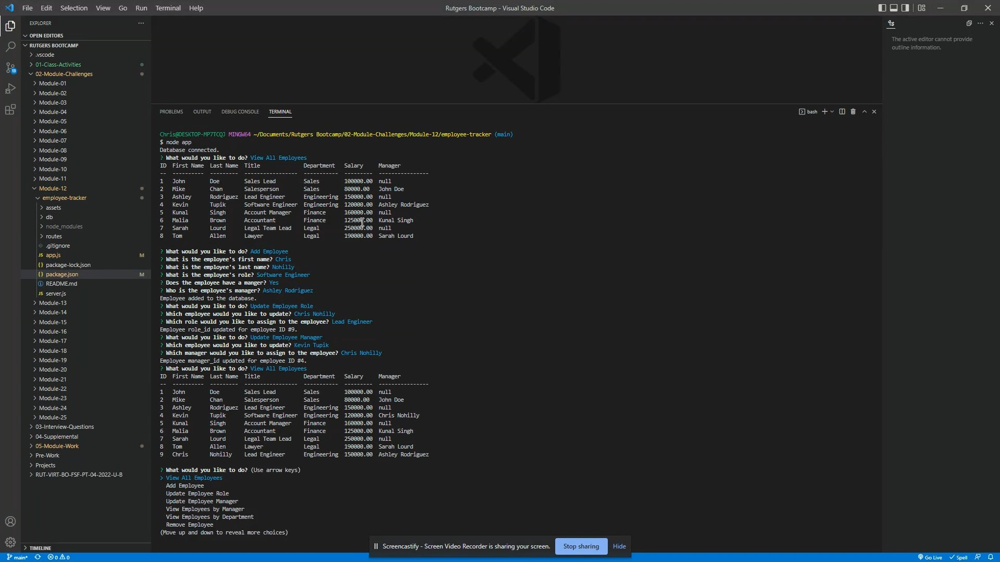

# 12 SQL: Employee Tracker

## Description

This project was to create a Command Line Interface (CLI) with a database using Node and the packages Inquirer (version 8.2.4) and mysql2. The code was written to be modular, separating the different queries to be made into different javascript files and accessing them using promises and then statements. The user has the ability to edit most if not all the data of the database through the CLI and appropriate menus are presented to the user to input data for new entries or lists are presented to choose what changes to make.

Video demonstrating the application: [Employee Tracker](https://www.youtube.com/watch?v=oBKT6TY1lLM)

## User Story

```md
AS A business owner
I WANT to be able to view and manage the departments, roles, and employees in my company
SO THAT I can organize and plan my business
```

## Acceptance Criteria

```md
GIVEN a command-line application that accepts user input
WHEN I start the application
THEN I am presented with the following options: view all departments, view all roles, view all employees, add a department, add a role, add an employee, and update an employee role
WHEN I choose to view all departments
THEN I am presented with a formatted table showing department names and department ids
WHEN I choose to view all roles
THEN I am presented with the job title, role id, the department that role belongs to, and the salary for that role
WHEN I choose to view all employees
THEN I am presented with a formatted table showing employee data, including employee ids, first names, last names, job titles, departments, salaries, and managers that the employees report to
WHEN I choose to add a department
THEN I am prompted to enter the name of the department and that department is added to the database
WHEN I choose to add a role
THEN I am prompted to enter the name, salary, and department for the role and that role is added to the database
WHEN I choose to add an employee
THEN I am prompted to enter the employee’s first name, last name, role, and manager, and that employee is added to the database
WHEN I choose to update an employee role
THEN I am prompted to select an employee to update and their new role and this information is updated in the database
```

## Product

Demonstration Video: 

[](https://www.youtube.com/watch?v=oBKT6TY1lLM)
